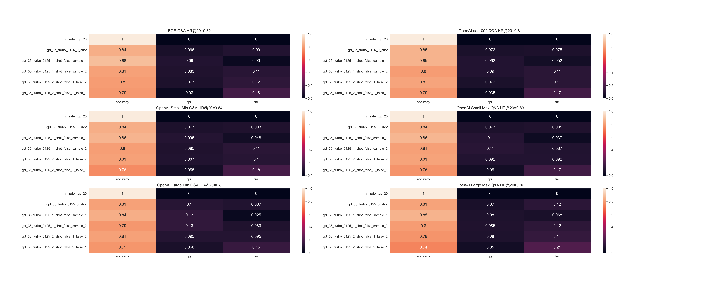

# Asclepius-synthetic-clincal-notes-retrieval-benchmark

## Retrieval Results

### Question Answering Task

| Embedding Model        | Embedding Dimension | Hit Rate @ 20 | MRR @ 20 | Link to Experiment                                                                                                       |
|------------------------|---------------------|---------------|----------|--------------------------------------------------------------------------------------------------------------------------|
| jina-v2-base-en        | 768                 | 0.51          | 0.37     | [here](https://app.parea.ai/public-experiments/parea/Asclepius-retrieval-benchmark/e7c2235d-ffa2-4273-84ce-c97657754645) |
| bge-base-en-v1.5       | 768                 | 0.81          | 0.70     | [here](https://app.parea.ai/public-experiments/parea/Asclepius-retrieval-benchmark/9471ccfd-ec87-4316-bc77-ba8314753cf4) |
| text-embedding-ada-002 | 1536                | 0.81          | 0.69     | [here](https://app.parea.ai/public-experiments/parea/Asclepius-retrieval-benchmark/26628eba-3719-4080-8d32-229ca382b50b) |
| text-embedding-3-small | 512                 | 0.84          | 0.73     | [here](https://app.parea.ai/public-experiments/parea/Asclepius-retrieval-benchmark/a17752e5-8095-45b1-a864-e838c54e7974) |
| text-embedding-3-small | 1536                | 0.84          | 0.73     | [here](https://app.parea.ai/public-experiments/parea/Asclepius-retrieval-benchmark/ab4713fc-0a28-431f-8f86-94664cfe38dc) |
| text-embedding-3-large | 256                 | 0.82          | 0.68     | [here](https://app.parea.ai/public-experiments/parea/Asclepius-retrieval-benchmark/bb583b9b-2ecb-43d9-8fc8-d20c2deacb86) |
| text-embedding-3-large | 3072                | 0.85          | 0.73     | [here](https://app.parea.ai/public-experiments/parea/Asclepius-retrieval-benchmark/b1655759-b460-40f8-b394-ad152f953973) |

### Paraphrasing Task

| Embedding Model        | Embedding Dimension | Hit Rate @ 20 | MRR @ 20 | Link to Experiment                                                                                                       |
|------------------------|---------------------|---------------|----------|--------------------------------------------------------------------------------------------------------------------------|
| jina-v2-base-en        | 768                 | 0.07          | 0.04     | [here](https://app.parea.ai/public-experiments/parea/Asclepius-retrieval-benchmark/5e40886d-7e41-4f1e-8369-3d5c3bd2765b) |
| bge-base-en-v1.5       | 768                 | 0.50          | 0.37     | [here](https://app.parea.ai/public-experiments/parea/Asclepius-retrieval-benchmark/81fae839-8945-42a4-90e4-78e2a3b84648) |
| text-embedding-ada-002 | 1536                | 0.57          | 0.44     | [here](https://app.parea.ai/public-experiments/parea/Asclepius-retrieval-benchmark/0029f82d-7b92-4981-a60d-4cd5126651a8) |
| text-embedding-3-small | 512                 | 0.59          | 0.46     | [here](https://app.parea.ai/public-experiments/parea/Asclepius-retrieval-benchmark/9625a8b6-3295-464b-ba44-ffa2e8ae314d) |
| text-embedding-3-small | 1536                | 0.59          | 0.46     | [here](https://app.parea.ai/public-experiments/parea/Asclepius-retrieval-benchmark/2340a279-d91d-481b-9f52-e517678f8d99) |
| text-embedding-3-large | 256                 | 0.61          | 0.44     | [here](https://app.parea.ai/public-experiments/parea/Asclepius-retrieval-benchmark/91e1afc5-fb64-4a8b-9866-8ab3f2ce01c0) |
| text-embedding-3-large | 3072                | 0.64          | 0.48     | [here](https://app.parea.ai/public-experiments/parea/Asclepius-retrieval-benchmark/e68de8bd-d00c-41aa-8390-56c19b22af67) |

## Using LLM to measure hit rate without having access to the correct label

While evaluating retrieval during experimentation is easy as one typically evaluates the retrieval on a dataset which is 
labeled, it is oftentimes not possible to do the same when evaluating retrieval which is used in production. 
This motivates to define an evaluation method which is reference-free, i.e., it doesn’t have access to the correct answer.

The LLM eval metric was tested on a dataset over 400 randomly-sampled samples for each dataset & embedding model.

### Creation of the LLM metric

The easiest way to create a LLM-based eval metric is to use a zero-shot GPT-3.5-turbo-0125 based evaluation.
The prompt instructs the model to assess whether the answer to a given question is among 20 retrieved results. 
It uses JSON mode to instruct the model to return a field called thoughts (which gives the model the ability to think 
before deciding) and a field called final_verdict (which is used to parse the decision of the LLM).
This is encapsulated in Parea's pre-built LLM evaluation (Link to 
[Python implementation](https://github.com/parea-ai/parea-sdk-py/blob/main/parea/evals/rag/context_has_answer.py)
and [docs](https://docs.parea.ai/api-reference/sdk/python#context-has-answer-factory)).

#### Using Few-Shot Examples

To improve the accuracy of the LLM-based eval metric, few-shot examples were used. Concretely, the few-shot examples were:
- few shot example 1: an example where `jina-v2-base-en` didn’t retrieve the right answer for a Q&A task
  - name is indicated by `false_1` / `false_sample_1` in evaluation metric name 
- few shot example 2: an example where `bge-base-en-v1.5` didn’t retrieve the right answer for a paraphrasing task
    - name is indicated by `false_2` / `false_sample_2` in evaluation metric name

The implementation of the eval metrics are in [evals.py](evals.py).

### Results

The results are presented as a heatmap measuring accuracy, false positive (fpr) & false negative rate (fnr) of evaluation metric with hit rate.

### Question Answering Task

- 0-shot evaluation metric has great overlap with hit rate: 81-88%%
- 1-shot evaluation metric based on few shot example 1 consistently improves accuracy of eval metric with hit rate: 83-88%
- 1-shot eval metric based on few shot example 2 degrades performance; 
- combining both few-shot examples degrades performance by significantly increasing the false negative rate

Link to experiments:

- [jina-v2-base-en Q&A 400 samples](https://app.parea.ai/public-experiments/parea/Asclepius-retrieval-benchmark/65a69670-43ec-4f7e-8025-e1f04360a149)
- [bge-base-en-v1.5 Q&A 400 samples](https://app.parea.ai/public-experiments/parea/Asclepius-retrieval-benchmark/1780cc81-825f-4273-91ee-01151473d41c)
- [text-embedding-3-small 512-dims Q&A 400 samples](https://app.parea.ai/public-experiments/parea/Asclepius-retrieval-benchmark/3aa6a7ae-28bb-4570-92c2-9a8347f42cb9)
- [text-embedding-3-small 1536-dims Q&A 400 samples](https://app.parea.ai/public-experiments/parea/Asclepius-retrieval-benchmark/192b0f86-aca5-4e7e-b251-85a89ea975d8)
- [text-embedding-3-large 256-dims Q&A 400 samples](https://app.parea.ai/public-experiments/parea/Asclepius-retrieval-benchmark/64518f1b-9f77-4daf-a316-c3671e42f4d8)
- [text-embedding-3-large 3072-dims Q&A 400 samples](https://app.parea.ai/public-experiments/parea/Asclepius-retrieval-benchmark/8704644b-db26-4b44-8c61-778eeaec59d4)

### Paraphrasing Task

- 0-shot evaluation metric has low accuracy
- both 1-shot eval metric improve upon 0-shot
- combining 2 examples into 2-shot eval metric yields synergistic effects when order is few shot example 1 followed by few shot example 2
- there isn’t always an improvement over using 1-shot eval metric when combining both examples in the other way

Link to experiments:

- [jina-v2-base-en Paraphrasing 400 samples](https://app.parea.ai/public-experiments/parea/Asclepius-retrieval-benchmark/c5984bad-41d4-4dbd-b3a4-e0fc03323eab)
- [bge-base-en-v1.5 Paraphrasing 400 samples](https://app.parea.ai/public-experiments/parea/Asclepius-retrieval-benchmark/e48d3ea3-1d92-498e-82bb-7967b49d6a9b)
- [text-embedding-3-small 512-dims Paraphrasing 400 samples](https://app.parea.ai/public-experiments/parea/Asclepius-retrieval-benchmark/80ce6c32-6bf4-4b7f-aa93-bc2f528c4dbb)
- [text-embedding-3-small 1536-dims Paraphrasing 400 samples](https://app.parea.ai/public-experiments/parea/Asclepius-retrieval-benchmark/249b4566-50f6-4748-955d-e2e70c4eafdc)
- [text-embedding-3-large 256-dims Paraphrasing 400 samples](https://app.parea.ai/public-experiments/parea/Asclepius-retrieval-benchmark/faf6f2b3-afd0-4ee1-bd06-34efd4b1bab0)
- [text-embedding-3-large 3072-dims Paraphrasing 400 samples](https://app.parea.ai/public-experiments/parea/Asclepius-retrieval-benchmark/aaa79a2b-bf6b-445c-aba1-b095d341ba7b)
